# 项目简介

从二维的图像显示技术问世以来，如何让人享受到三维的视觉体验，就成了一个吸引人的问题。从生理上说，人的三维视觉体验主要有两个来源，一是双眼位置不同导致观看到的图像的细微差别，二是观看物体时眼球晶状体的聚焦位置。历史上的三维视觉体验技术，常常需要观看者做出特殊的动作，或者佩戴特殊的设备，这阻碍了三维视觉体验技术的普及。所以后来人们研究出来了所谓“裸眼3D技术”，即观看者不需要佩戴任何设备，直接注视屏幕，就能感受到三维效果的技术。

针对目前的裸眼三维显示技术具有的*通用性差*、*需要特定的硬件*、*高价格*等缺点，我们目标是：首先，降低裸眼三维显示技术对硬件的依赖，将优化主要留给软件，这样即可以提高通用性；其次，使用低成本的光栅材料来达到高质量三维显示效果；同时，我们的实现方案对不同屏幕具有普适性，不需要特定硬件。

首先，我们通过对光栅的光学特性的研究，理解其对于显示屏所发出光的影响（尤其是研究当光栅放置得不完美时或未与像素对齐时的情形），为使用软件手段弥补这类错误打下基础；然后，我们将开发一套软件工具，可以完成对光栅的正确安装与调试，使得用户可以在无相关背景知识的情况下，完成对光栅参数的测量和对光栅摆放的调试工作，并通过视频源或游戏引擎输出静态或动态图像，使得用户观看到高质量的三维效果。

# 前期进展

## 光学理论研究

在光学特性的研究方面，我们自行开发了一个光学模拟平台 --- Grating Advanced Simulation Platform（GASP）。该平台由Python编写，前端界面由Pygame提供，允许用户在工作区放置若干光源，光栅，透镜。 并且能够追踪光线，计算实际折射情形。以下的的图片由GASP模拟平台产生.

下图是光栅的基本结构，整个光栅的结构非常简单，是在一块透明的塑料板上刻出来很多半圆柱状的棱，每一个棱都能起到类似于透镜的作用，可以将塑料板下面的像素成像到不同的方向.

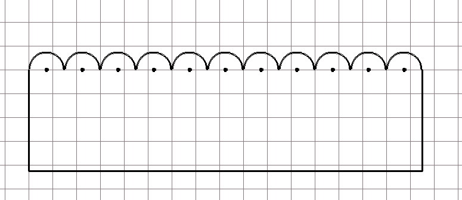

为了便于描述，下图将定义一些参数：

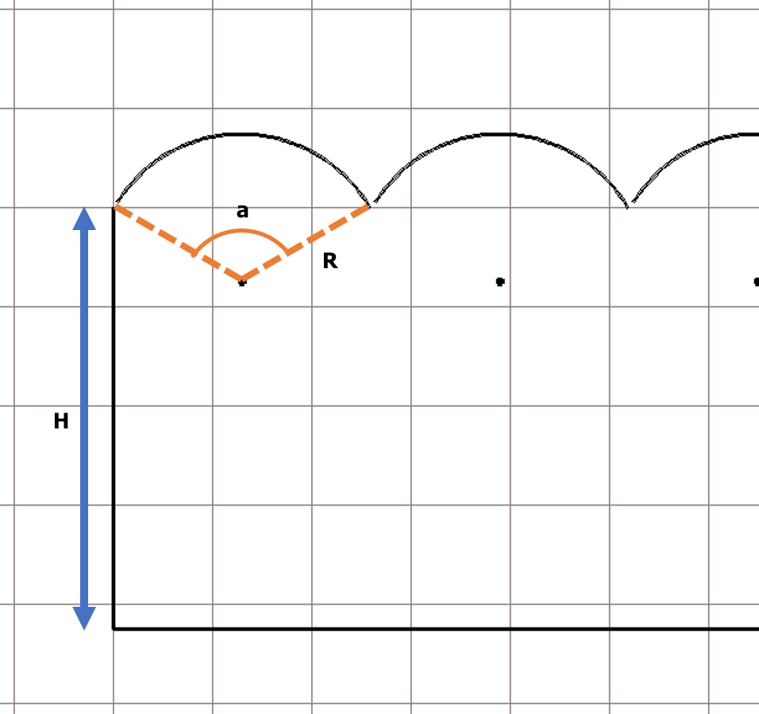

对于单个像素点， 其在类似经过不同的棱的成像之后可以得到下面这样的结果， 一个点在经过这个棱镜组之后， 变得只能在一些特定方向被观察到， 这是我们想要的效果. 对于一个点， 要只能够在特定的方向观察到是我们项目的前提.

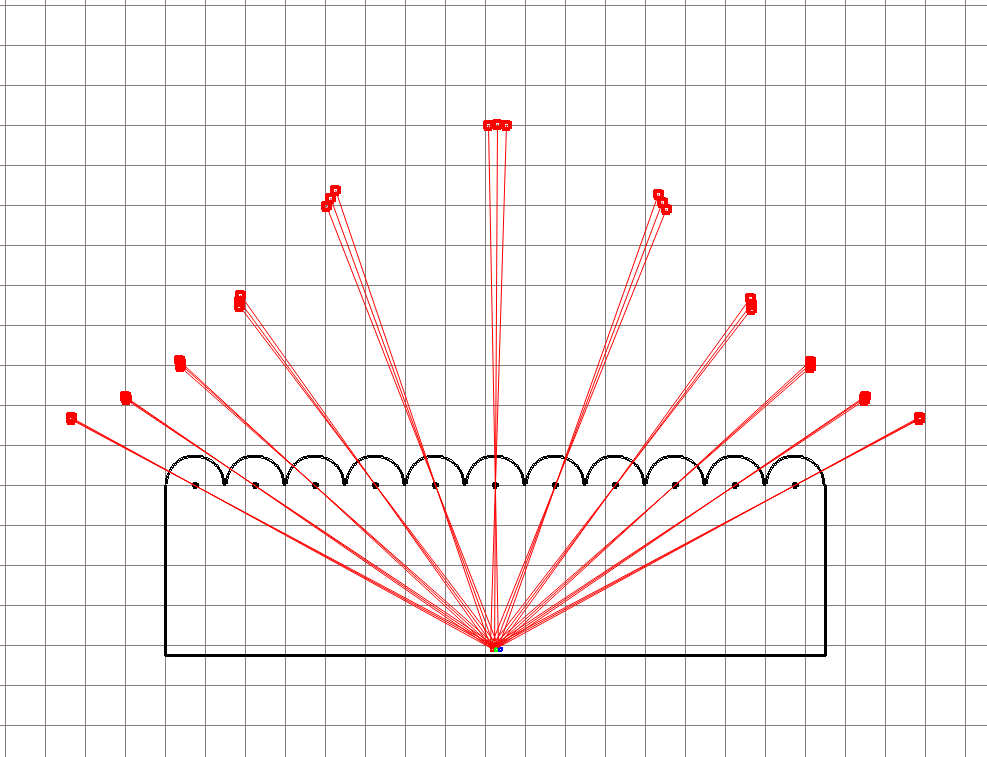

由于我们已经具备了将像分开的前提条件， 所以下面是加入第二个像素之后的成像效果. 红色像点和黄色像点是两个像素分别成像之后的结果. 在图中的1， 2， 3区域， 当人眼在扇区的中间观察的时候， 两只眼睛就能够看到两种不同的像素.

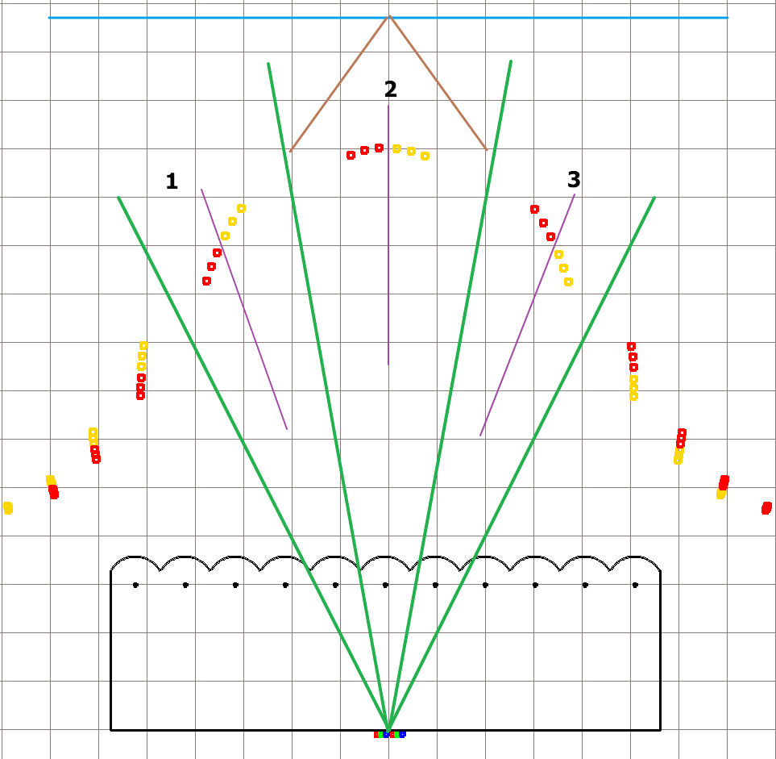

但是， 这里仅仅是一组像素成像的结果， 可以看出， 像素成的像并没有把空间给填满而我们更为关心的是很多屏幕像素点成像的结果. 希望能让像素成的像构成一个闭合的区域. 让用户在各个角度都能看到像.

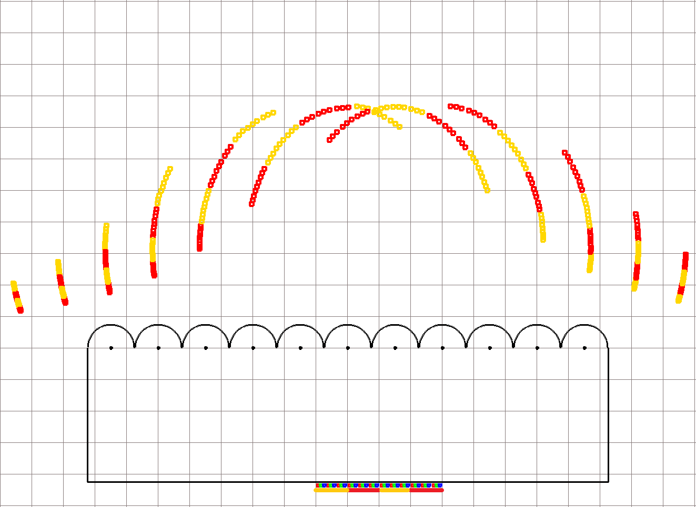

于是我们就可以直接去考虑很大量像素去显示两幅图像的情况. 用户真正的观察区域是在最上方的平坦区， 可以看到2个左眼区域和2个右眼区域.

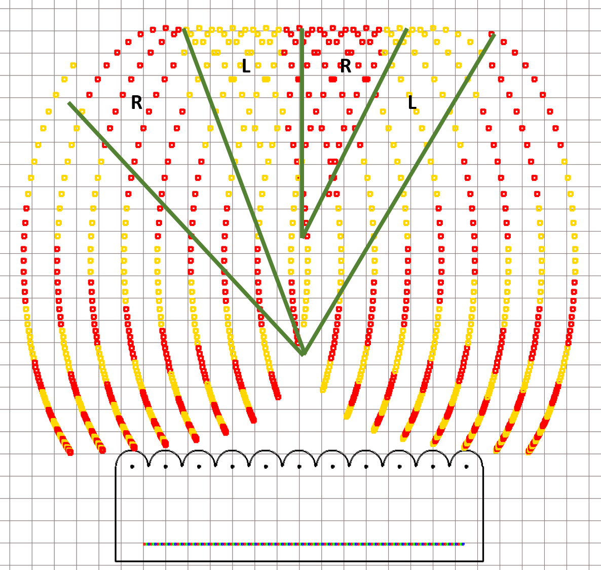

实际上， 由于在模拟的参数下， 任选6个像素， 其像都可以完整地围成一个闭合区域， 所以在这6个像素中我们可以有很多种显示方案， 比如每3个去显示一幅图画中的一个像素点. 总共可以显示两幅图画. 但是我们也可以插入更多的图画， 比如每2个像素去显示一个源像素点， 这样可以显示3幅图画. 用户可以在不同的地方看到不同的3D效果（即可以表示出更多的观察方向的立体效果）. 对于模拟的参数， 我们最多可以显示6张图画. 这两个的模拟图如下所示.

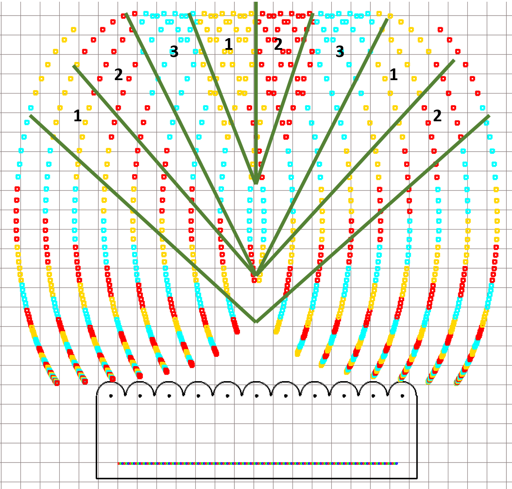

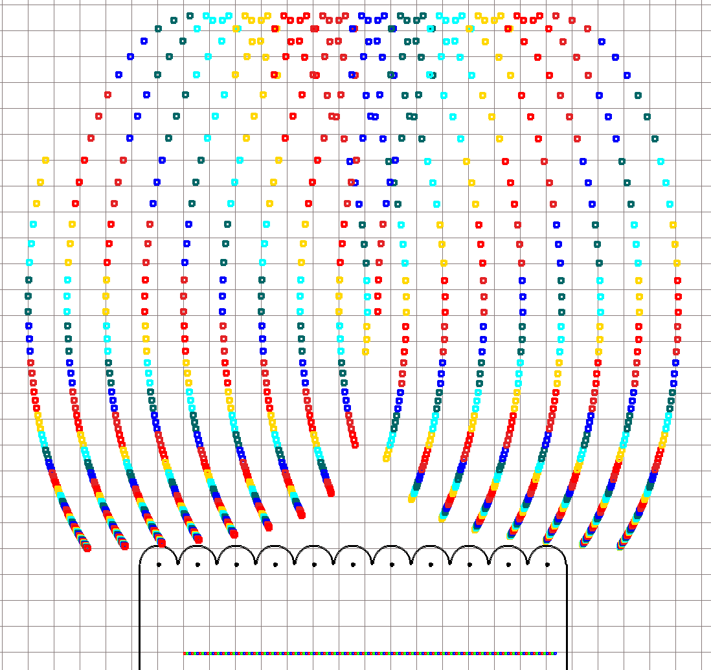

## 人的三维感

通过对于三维图像显示原理的研究，我们可以将人眼对于三维图像的感受归纳为静态三维感与动态三维感。其中，静态三维感为观察者在双眼观察位置保持静止时，因左右眼所观察到的画面不同而产生的立体感，而动态三维感则是观察者观察方式（双眼位置、观察角度等）发生动态改变时看到的画面变化以及视频本身带来的立体感。

为实现静态三维感，我们需要使左右眼看到不同的图像，这点与传统的非裸眼三维显示技术具有相似性；不同的是，非裸眼三维显示技术通过在观察者眼睛部位安置光学器件来达到该目的，而我们基于光栅的技术则是通过位于屏幕的光学元件来实现使双眼看到不同的图像的目的。

而对于动态三维感，要求观察者改变观察方式时可以看到根据其观察方式而改变的图像，比如，当观察者的头部微微左移时，可以观察到与之前不同的三维场景。这一点是非裸眼三维显示技术无法做到的，因为它们的技术实现方式导致了它们只能使观察者的左右眼看到固定的对应图像，而不会随着观察方式的改变而改变。

动态图像本身可以给观察者带来一定的视觉冲击，配合上述静态三维感与动态三维感，可以令观察者体验到更加良好的三维感受。首先，由于双眼看到了不同的图像，人的大脑会将画面信息与日常生活中不同景深的场景联系，并得到第一层的三维感受；其次，若此时观察者的观察方式有一定的变化，而所看到的图像有了相应的变化，那么，对于三维场景的感受便会更深；配合适合的动态内容，便可以产生预期的三维体验。

## 双图层与多图层的选择

根据前述的光栅特性分析，我们可以知道，在一个栅格对应的像素组中，我们可以在其中安排不同的图层，来使得观察者的左右眼分别根据观察位置的不同而观察到不同的图层的对应图像。对于具体图层数量的选择，有双图层与多图层两种设计。

首先参考前文所述三维立体画的例子，当我们观察这张三维立体画时，如果令头部微微移动，可以观察到荷花与荷叶的相对位置是逐渐地改变的，这对应于前文提到的动态三维感。这种实现方法应用了多图层的设计，即对于一只眼睛来说，移动视角会看到多个图层（多于两个），而左右眼看到的图层也同时具有一定的差距，这样可以叠加静态三维感与动态三维感，形成更好的三维体验。

而普通的三维电影则是对应双图层设计，即对于一只眼睛来说，移动视角看到的图层只有两个，在光栅实现下，我们必须保证左右眼恰好看到对应的图像，并且需要头部保持一定的姿势不动，这会使得应用场景受到一定局限。

对应到我们所研究的具体光栅，我们可以在像素组中安排至多13个图层，一般而言，为了避免重影以及便于均等划分，我们将位于边缘的一个像素置为空，即不显示任何图像（显示黑色），剩余的12个像素，可以将它们划分为2、3、4、6或12组，达到不同的层次效果。

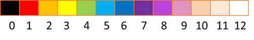

如上图所示，13个方格分别表示一个栅格对应的像素组中的13个子像素，其中0号为不使用的空像素。如果我们采用多图层的设计，将这12个子像素指派给12个图层，每个图层对应了视角发生微移时的不同图像，那么根据前文所述的视角分析，我们可以知道：首先，一只眼睛会看到约3个子像素的内容；其次，双眼看到的中心子像素是不一样的；并且，随着头部的移动，双眼看到的中心子像素都会产生变化。如下所示：由左眼看到2、3、4图层，右眼看到8、9、10图层，在每个图层对应的图像较为连贯且相对位置正确的情况下，就可以观察到正确的三维图像。

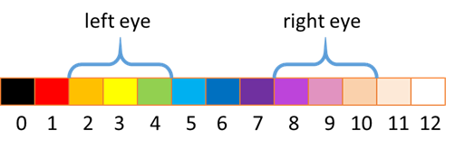

如果头部有微移，则左右眼所看到的中心子像素也会随着发生改变，如果两只眼所看到的图层仍然符合上图的相对关系，即中心子像素都在同一个栅格对应的像素组中，则看到的三维图像仍然是正确的，并且会随着头部微移看到三维场景随之微移，这使得动态三维感产生。但是，如下图，若双眼所观察的中心子像素对应于不同栅格，这样左右眼看到的图层会有相反的三维效果，就会使得效果不好。此时经过测算，头部的移动导致的中心子像素最大移动范围为约一个像素组。

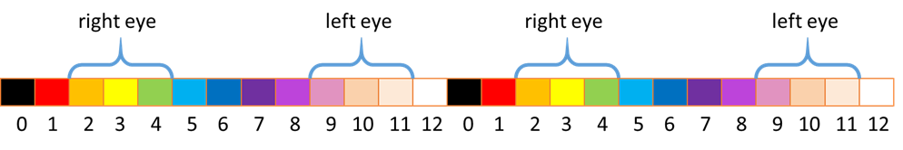

针对双图层也有类似的问题，需要保证头部的位置在一定的范围内不动。但此时，必须保证左眼和右眼严格地控制在两个图层的范围之中，这就要求头部几乎不能移动。

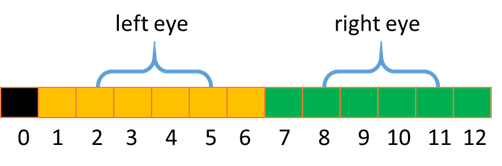

需要指出的是，虽然根据上述分析，多图层设计的可移动范围相对而言较大，但是，多图层设计实际上是每一个角度都看到了不同图层，所以邻层次差距较大时有不可避免的重影问题。

## 最新成果

在前期测试阶段，我们主要使用一台手机作为显示设备，
在电脑利用Python的Pygame库进行图像处理和渲染工作，
将结果以VNC发送到覆盖光栅的手机屏幕上查看效果。
在这个测试环境下，我们已经进行了一系列实验，目前取得了不错的效果。

#### 测量光栅宽度

选定合适的光栅后，我们首先需要测量其光栅宽度，
具体而言是指每条光栅所对应的像素数。
为了精确测出此值，我们利用*莫尔条纹*效应，
制作了一个显示等间距线条的程序，其线条间距可以由键盘控制微调为任何值，
当线条间距完全等于光栅宽度时，会出现明显的干涉现象。
据此可得到非常精确的光栅宽度数值。

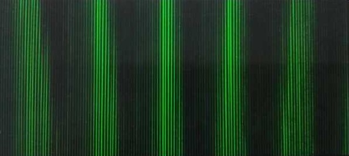

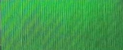

#### 测量光栅失焦程度

由于显示屏无法做到紧贴光栅底面，光栅必然有一定程度的失焦，
表现为不仅一个，而是像素组内的多个像素都会被呈现出来。
我们测量得出的结果是，测试环境中光栅总是会呈现3个像素。

#### 双图层测试

我们编写了一个将两张输入图像渲染为输出图像的程序，
使用图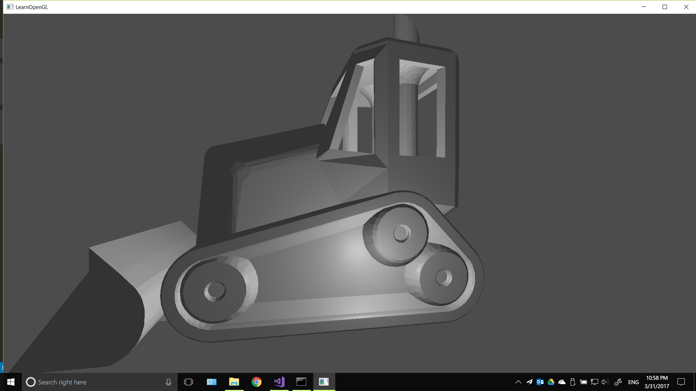中的三维物体制作了测试图像图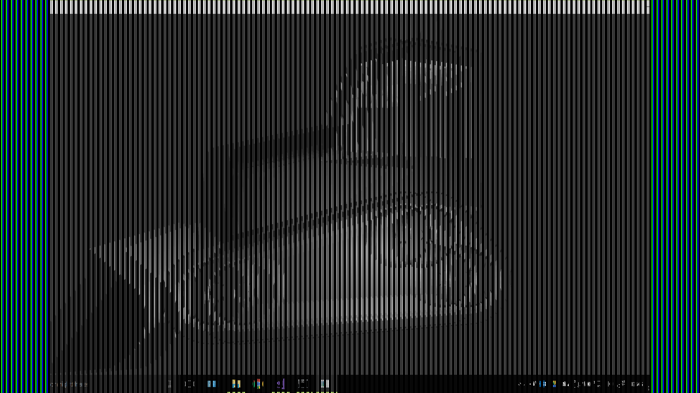。
然而观察发现，双图层的效果并不令人满意。
一方面，观看者的位置必须比较精确，否则会看到明显的黑条或重影现象；
另一方面，仅仅静态三维感给人的视觉刺激是不足的，三维效果不甚明显。

#### 多图层测试

仿照三维卡片画的原理，我们又用程序生成了12个图层用于进行多图层测试，
场景中的元素在各图层间线性地进行平移，这样只要左右眼看到不同的图层，
就一定会产生三维感。如果观看者左右移动位置，还能进一步感受到动态三维感。
这个测试十分成功，完全得到了预期的效果。
图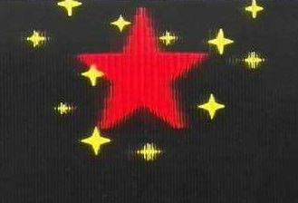和图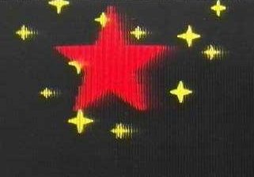展示了从两个不同的视角看到的效果。

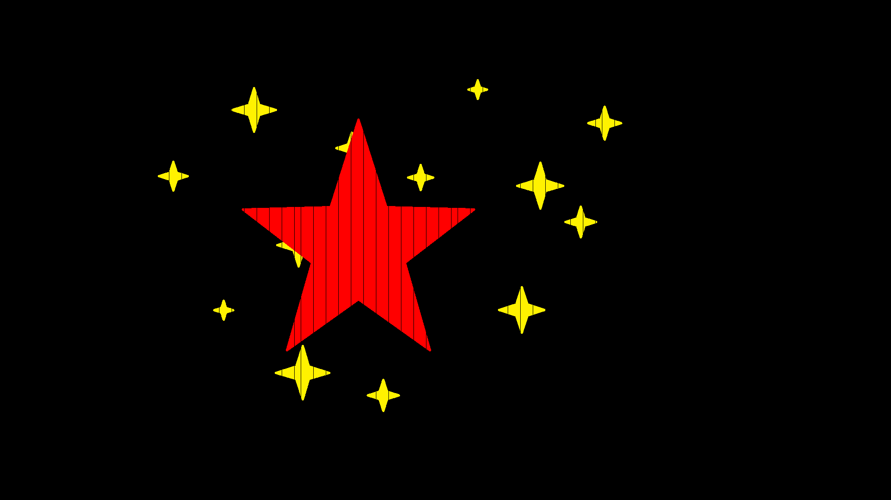

## 主要挑战

目前我们遇到的主要问题是光栅的厚度与圆柱的夹角并不匹配的问题. 因为我们项目组购买的光栅原本的用途是用于制作光栅立体画， 所以光栅的厚度和夹角是经过精确计算的， 用于适配物体紧贴着光栅下表面的情况. 但是现实中的屏幕发光的地方是在屏幕表面下方一定深度的区域. 这就导致了原来的根据紧贴着下表面的情况计算出来的参数不再合适. 也就导致了显示的质量下降的问题. 一般来说， 光栅的厚度与光栅的目数 （每英寸棱的个数）是成负相关的. 而对于50目以上的光栅板， 其厚度已经小于像素点到屏幕表面， 这时候就会导致屏幕的扇区夹角变小. 从而导致用户观察到的图像出现重影. 下图可以说明这一点.

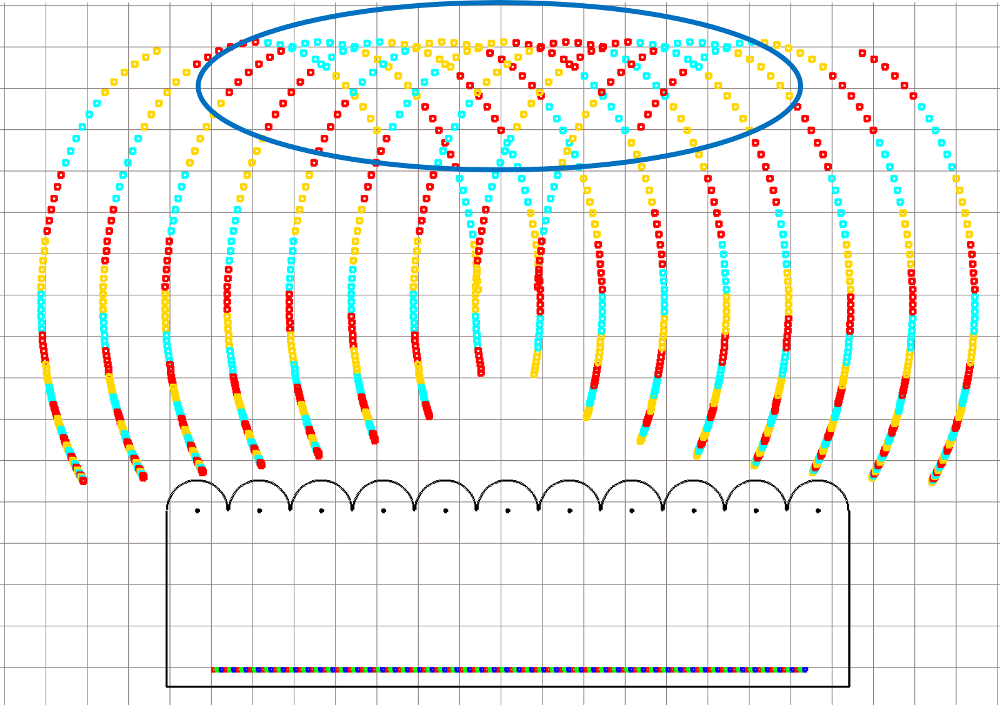

# 后续工作

## 裁剪光栅

如上文所述， 这一系列问题都是由于光栅与实际屏幕不适配造成的，所以如果能直接裁剪光栅，减少光栅厚度（即减去一个屏幕的厚度）， 像素就能恰好落在合适的成像面上，也就不会出现严重的失真与重影的问题.

## 多图层镜像效应

我们看到的像素排列与实际的像素排列有个水平方向的镜像对称，我们把这种现象称为镜像效应。如图所示，实际图像中的一条光滑直线在用户视野中将会变成一个个锯齿，这种现象在直线的斜率较低时尤为明显，将会极大得影响三维感。

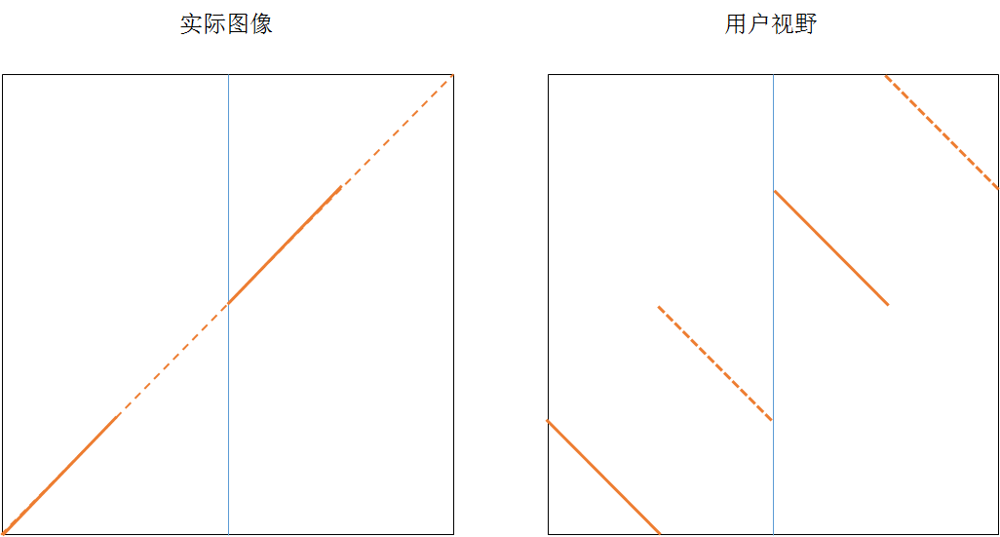

一种可能的解决方案是根据镜像对称的原理来反构造出一个能正常显示的图，即直接生成镜像效应作用过的图形，利用两次镜像效应相互抵消就可以得到正确的图形，如图：

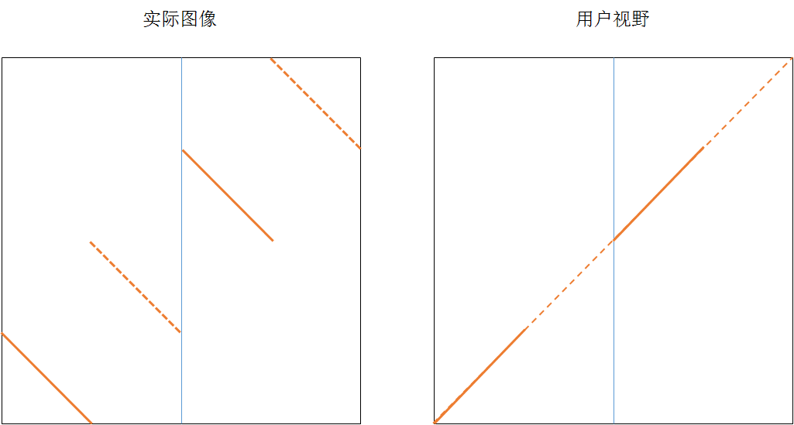

但是这种方案过于理想，只有在如果我们的头部进行了偏移便会出现交错的情况，如图：

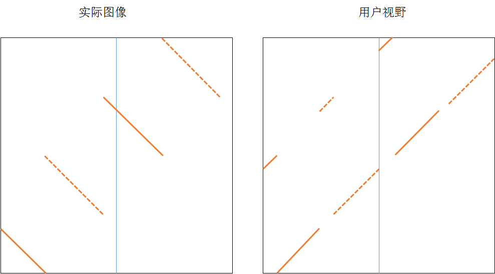

这样的交错会导致同样的不良效果，使用反镜像来消除并不可行。我们下一步会想办法尽可能减轻镜像效应产生的锯齿现象。
